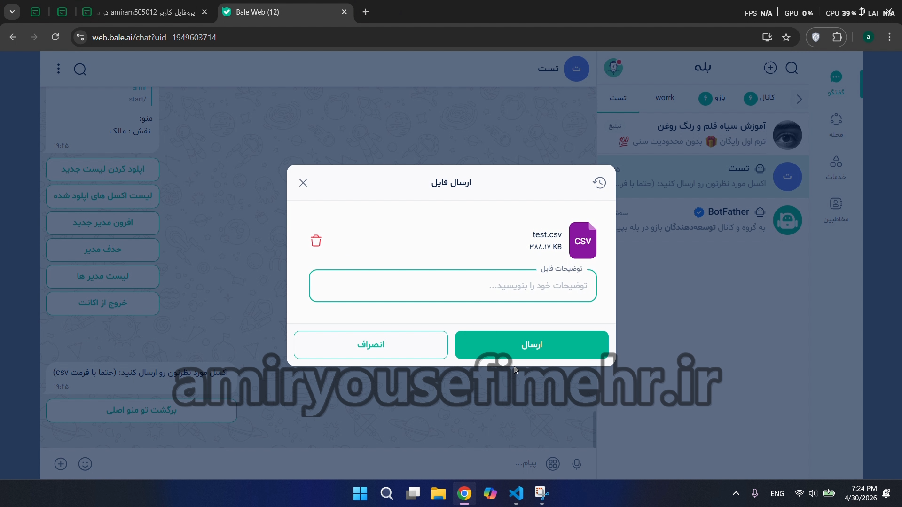
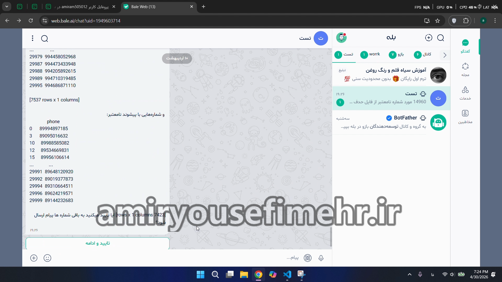

#  ربات مدیریت و ارسال پیام انبوه بله

## معرفی پروژه

این پروژه یک **ربات مدیریت و ارسال پیام انبوه برای پیام‌رسان بله** است که با هدف پردازش حجم بالای شماره‌های تلفن و مدیریت فرآیند ارسال پیام طراحی و توسعه داده شد.

ادمین‌ها می‌توانند فایل Excel حاوی شماره‌های موبایل را از طریق ربات دریافت و برای آن نام اختصاصی تعیین کنند. سیستم پس از پردازش و اعتبارسنجی شماره‌ها، امکان مدیریت و ارسال پیام‌های هدفمند را فراهم می‌کند.

---

##  پیش‌نمایش پروژه

###  تصاویر پروژه

---

### 🎥 ویدئوی عملکرد

[ مشاهده ویدئوی عملکرد ربات](./assets/demo.mp4)

---

##  پردازش فایل Excel

یکی از بخش‌های اصلی پروژه، دریافت و پردازش فایل‌های Excel حاوی شماره تلفن است.

سیستم قابلیت‌های زیر را در اختیار ادمین قرار می‌دهد:

* دریافت فایل Excel
* تعیین نام اختصاصی برای هر فایل
* استخراج شماره‌های موبایل
* اعتبارسنجی شماره‌ها
* پردازش حجم بالای داده
* مدیریت فایل‌های ذخیره‌شده

برای پردازش و مدیریت داده‌ها از **Pandas** استفاده شده است.

---

##  سیستم مدیریت ادمین

ربات دارای سیستم مدیریتی برای کنترل دسترسی کاربران است.

امکانات مدیریتی شامل:

* مدیریت ادمین‌ها
* تعریف سطوح دسترسی مختلف
* کنترل عملیات مجاز هر ادمین
* مدیریت فایل‌های شماره
* مدیریت فرآیندهای ارسال

این ساختار امکان مدیریت بهتر عملیات و کنترل دسترسی کاربران مختلف را فراهم می‌کند.

---

##  سیستم ارسال پیام

پس از آماده‌سازی و اعتبارسنجی شماره‌ها، سیستم امکان ارسال پیام‌های هدفمند را فراهم می‌کند.

برای مدیریت ارسال در حجم بالا، فرآیند ارسال به‌صورت کنترل‌شده انجام می‌شود تا فشار بیش از حد به سرویس وارد نشود و فرآیند ارسال پایدارتر باشد.

---

##  Rate Limiting و مدیریت ارسال

یکی از چالش‌های اصلی پروژه، **مدیریت حجم بالای ارسال و جلوگیری از ارسال بیش از حد مجاز** بود.

برای کنترل این فرآیند از تکنیک‌هایی مانند **Rate Limiting** استفاده شد تا سرعت ارسال مدیریت شده و فرآیند ارسال پایدارتر انجام شود.

---

##  لاگ‌گیری و مانیتورینگ

سیستم دارای **Real-time Logging** برای مشاهده وضعیت عملیات است.

این قابلیت به مدیر کمک می‌کند وضعیت پردازش شماره‌ها و ارسال پیام‌ها را بهتر بررسی کرده و خطاهای احتمالی را سریع‌تر شناسایی کند.

---

##  امنیت و مدیریت حساب‌ها

فرآیند ورود و خروج حساب‌ها به‌صورت کنترل‌شده پیاده‌سازی شده و دسترسی به بخش‌های مدیریتی بر اساس سطح دسترسی کاربران مدیریت می‌شود.

---

##  نتیجه پروژه

طبق اطلاعات ثبت‌شده از اجرای پروژه، سیستم باعث:

* **افزایش ۵ برابری سرعت ارسال**
* کاهش نرخ خطا به **کمتر از ۱٪**

شد.

این پروژه نمونه‌ای از ترکیب **اتوماسیون، پردازش داده و توسعه ربات پیام‌رسان** برای مدیریت فرآیندهای ارسال در مقیاس بالا است.

---

## مشخصات پروژه

| مشخصات                | توضیحات                        |
| --------------------- | ------------------------------ |
| **نقش**               | Full-stack Bot Developer       |
| **نوع سرویس**         | برنامه‌نویسی و توسعه نرم‌افزار |
| **مدت انجام**         | ۳ روز                          |
| **محدوده قیمت پروژه** | ۳,۰۰۰,۰۰۰ تا ۶,۰۰۰,۰۰۰ تومان   |

---

##  فناوری‌های استفاده‌شده

* **Python**
* **pybalebot**
* **Pandas**
* **Excel**
* **Big Data**
* **Rate Limiting**
* **Real-time Logging**

---

##  سفارش پروژه مشابه

اگر به توسعه ربات، پردازش داده، اتوماسیون یا سیستم‌های مدیریت ارسال نیاز دارید، می‌توانید برای ثبت سفارش و دریافت مشاوره با من در ارتباط باشید.

 **[ثبت سفارش پروژه](https://amiryousefimehr.ir/request-project)**

---

##  مشاهده نمونه‌کارهای بیشتر

 **[مشاهده رزومه و نمونه‌کارهای من](https://amiryousefimehr.ir/)**

---
